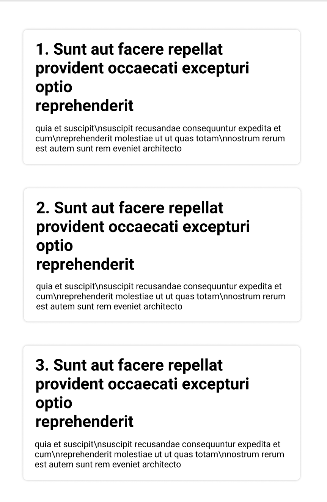
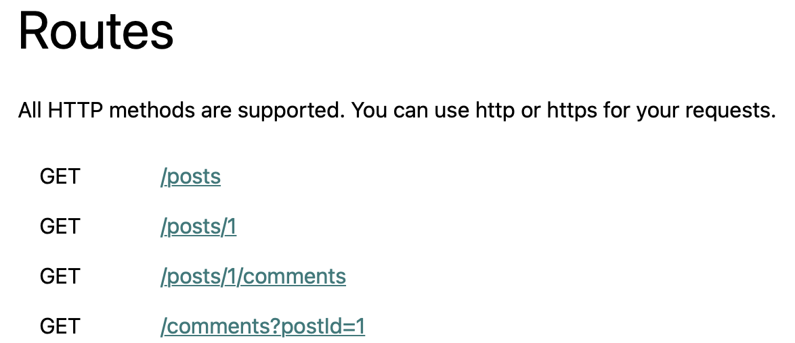

# Test technique - Mentor Goal

Utilisation de: **axios**, **bootstrap** (pas la version react-bootstrap), **.map()** ,de l'api : **https://jsonplaceholder.typicode.com** & des **HOOKS**

## Consignes

Le projet est simple : 

Il va falloir clone ce repo, installer les dépendants avec la commande **npm install** & le lancer avec **npm start**.

Une fois cela fait, il va falloir coder ! 

**Attention ! le code devra être entièrement en HOOKS & non en classe.** 

#### Partie 1 :

Dans un premier temps il va falloir créer une page blanche sur laquelle il y aura des cartes contenant un poste avec titre + déscription. Pour récupérer ces données il va falloir aller sur le lien de l'API et récupérer **tous** les postes via une requête API avec **axios**. Une fois ces données récupérées, il va falloir les afficher comme expliqué ci-dessous et montré ci-dessous.

#### Partie 2 :

Une fois cela fait, il va falloir faire en sorte que lorsque l'on clique sur une carte, une requête API est faite afin de récupérer tous les commentaires d'un poste. Ces commentaires ne sont pas a afficher mais à console log ! Donc lorsque l'on clique sur une carte, on pourra apercevoir dans la console tous les commentaires du poste.

PS : Pensez à bien utiliser au maximum bootstrap ! (Il y a sûrement certaines choses que vous ne pourrez pas faire avec seulement bootstrap mais utilisez quand même un maximum afin de prouver vos compétences ou votre capacité à apprendre cette librairie).

### Bonus : 

En **bonus** vous allez pouvoir faire deux choses : 

1 - Améliorer le style de cette interface, (ajouter couleurs, animations, ou autres).

2 - Lorsque l'on clique sur une carte, faire en sorte que ça redirige sur une seconde page avec tous les commentaires de la carte sur laquelle nous aurons cliqué.

En cas de problème, rélisez le sujet, faites de bonnes recherches et si jamais ça ne fonctionne toujours pas, nous contactez pour avoir des pistes.

## Extras :

Rendu minimum du projet :

Routes de l'API pouvant servir : 

